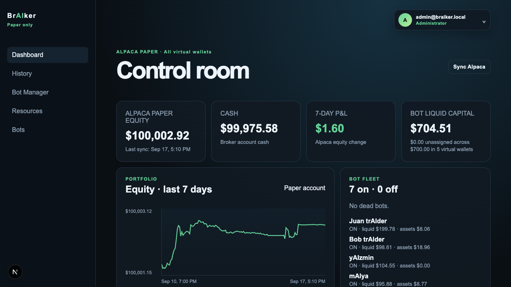
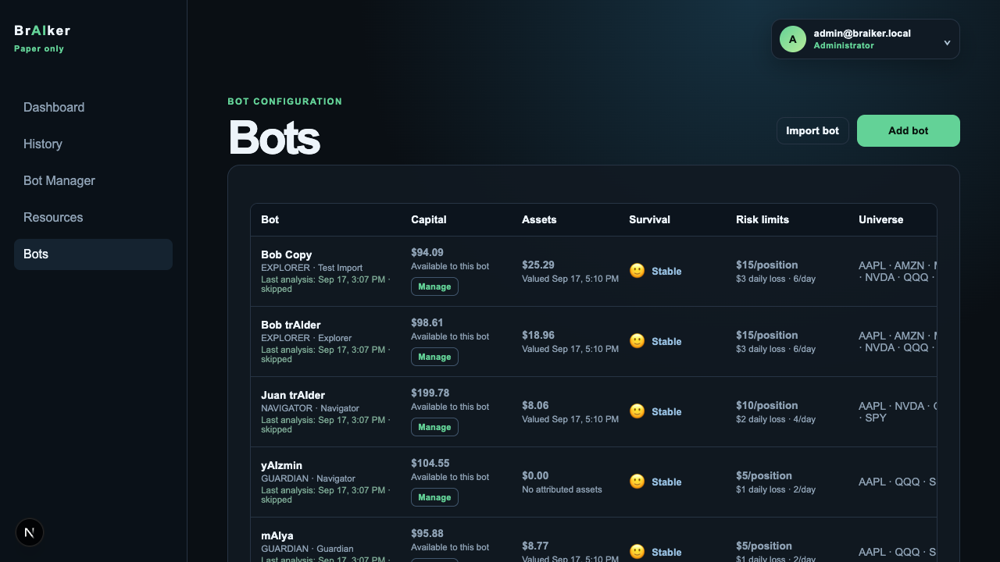
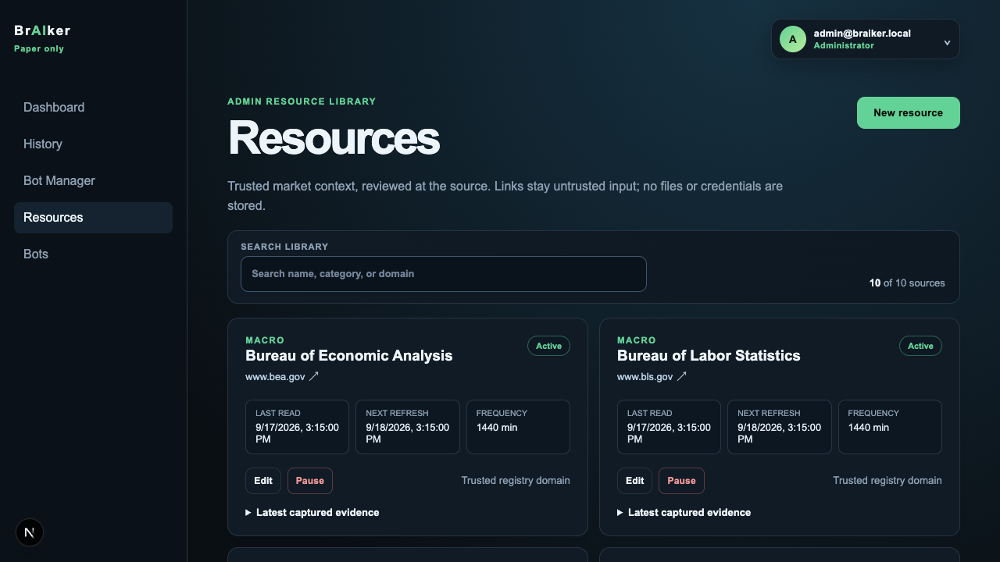
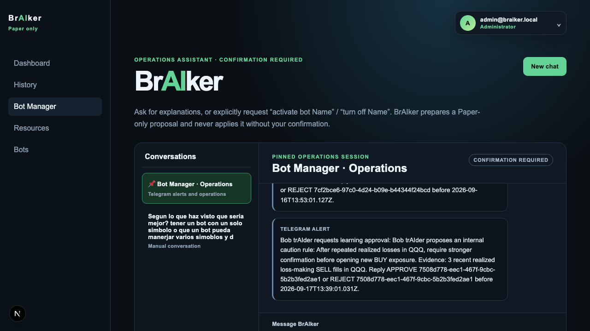

# BrAIker

## A paper-trading control room for disciplined experimentation

BrAIker gives teams a clear, auditable way to explore automated trading ideas without connecting strategy experiments to live money. Built around Alpaca Paper, it combines deterministic signals, isolated virtual portfolios, explicit risk gates, durable execution evidence, and an operations-focused interface that makes every decision explainable.

The result is a calm control room for testing strategies: see the whole fleet at a glance, trace every order back to its bot, review market context and analysis activity, and keep operational decisions behind deliberate confirmation steps.

### Product tour


The dashboard brings broker equity, cash, portfolio allocation, positions, recent orders, and fleet health into one view.


Each bot has isolated capital, visible survival state, bounded risk limits, its own watchlist, and a complete operational history.


The reviewed resource library keeps market context cited, bounded, and auditable while preserving the paper-only safety boundary.


Bot Manager turns operational questions into readable, confirmation-first conversations without granting chat the authority to trade or change controls.









BrAIker is a **paper-only**, multi-user trading-control application for US stocks and ETFs through **Alpaca Paper**. It uses Next.js, TypeScript, Prisma, and a dedicated MySQL 8 database.

This repository is under active construction. Read [`docs/PROJECT_CONTEXT.md`](docs/PROJECT_CONTEXT.md) before making product or implementation decisions, then [`docs/ARCHITECTURE.md`](docs/ARCHITECTURE.md) before touching data, worker, broker, or API code. Those documents distinguish implemented behavior from planned work.

## Product rules that cannot be weakened

- Alpaca Paper is the only supported broker and environment. Live trading, crypto, Binance, margin, shorting, options, leverage, and extended-hours trading are out of scope.
- A bot has isolated capital. It may never use another bot's allocation or the wallet's unallocated balance.
- Survival is mandatory, not a setting: the bot's capital is its oxygen. A zero-capital bot must become `DEAD` permanently and then cannot be switched on, edited, or deleted; its data is retained. The automatic zero-capital transition is documented below as an implementation gap.
- The user-facing bot control is one ON/OFF switch. There is no Simulation mode or exposed Paper-mode control. The old database enum value is legacy-only and must not be reintroduced in UI or API contracts.
- Personality changes decision style, never the safety boundary. Custom instructions cannot override risk checks or survival rules.
- Browser code never receives broker credentials. Do not log, return, commit, or place secrets in fixtures.

## Current implementation

Implemented today:

- Cookie-session authentication; Admin, Operator, and Viewer roles.
- Admin user management and password change flow.
- One server-only Alpaca Paper connection from `.env`, virtual wallets with a shared global capital pool, and scheduled global portfolio reconciliation.
- Admin-managed notification preferences with durable, de-duplicated webhook/email/Telegram delivery. A persisted **Enable Bot Manager on Telegram** master switch defaults off and, when off, prevents polling, pairing, alerts, reports, and Operations-chat mirroring even if the environment has a bot token. Required-status outages, OpenAI quota/billing rejections, and Bot Manager reports are delivered only to the enabled channels that selected them, then retried at a bounded interval until delivery succeeds. The selected daily-report preference receives a pre-market summary at 08:35 ET for the prior completed weekday and a closing summary just after the exchange closes (13:05 ET on an Alpaca-confirmed early close, otherwise 16:05 ET) scoped to the current New York market day. Weekly/monthly reports retain their 7-day/30-day windows. Every report summarizes fleet state, orders, aggregate scan outcomes, persisted daily briefing counts and bot-input totals, reviewed-resource citations, HIGH macro events added and upcoming guards, and sampled latest bot scan state. They use readable separated sections and one bounded source citation per line, never raw resource content or secrets.
- Server-side `.env` values make a delivery channel available but never enable notification preferences or the Telegram master switch; an inactive channel is neither validated nor used when saving the other channels. Restart both `web` and `worker` after changing a server-side environment value.
- Global, dismissible action feedback through toasts, so an error from a modal is never rendered elsewhere on the page.
- A fixed operational sidebar and compact top account menu on desktop; a single responsive mobile menu combines operational navigation, account administration, password management, and sign-out.
- Dashboard with global Alpaca Paper equity/cash, positions, and broker orders, plus a fleet summary across every accessible virtual wallet. Its Bot liquid capital is the sum of bot virtual cash (not broker equity); zero-equity startup placeholders are excluded from the seven-day chart and P&L.
- Order-first History across every wallet accessible to the signed-in user, with wallet, lifecycle, and bot filters plus an in-page paginator; selecting a wallet narrows the bot list and keeps its external Alpaca orders visible. The bot table is likewise paged. Each per-bot modal has separate **Operations**, **Analysis activity**, **Assets**, and **Performance** tabs and fetches older records in bounded pages rather than silently stopping at 100 rows. Performance distinguishes the original allocation and net later cash flows from current liquid capital, marked-to-market attributed assets, realized/unrealized P&L, virtual operating costs, and trading P&L; a migration supplies an immutable allocation event for pre-event bots. The chart returns the latest 90 complete daily equity observations, chronologically. A per-bot daily equity observation is replaced by the latest complete Alpaca valuation for that New York day; missing synchronized prices remain unavailable rather than using cost basis. Each modal exposes a deterministic, read-only survival indicator with native emoji, color, an accessible score bar, and the actual operational state. The score is a presentation of the existing survival band, not P&L, a risk override, or a reason to value low liquid cash as failure while capital is invested or reserved. Analysis records explain completed, skipped, and failed cycles in plain English even when no order is placed; retained scan activity is pruned after 30 days.
- Three bot profiles: Guardian, Navigator, Explorer; Admin-editable defaults for position, daily-loss, and trade-count caps, plus per-bot name, avatar, budget, symbols, instruction, and bounded risk limits. Each bot may opt into deterministic adaptive survival limits: the saved envelope remains its Admin-owned ceiling, while the worker may only reduce position, daily-loss, and trade-count limits after realized drawdowns. Changes are auditable in the bot history.
- Admin-managed global trading universe: Alpaca's active, tradable, non-OTC US-equity master list is synchronized server-side. Settings separates selected and available assets, searches each server-side, and paginates the available catalog so a large Alpaca refresh never hides a selected symbol. The ten familiar starting symbols are enabled initially; an Admin enables further assets before they appear in bot editors. Disabling a global asset immediately removes it from every bot watchlist and re-enabling never restores an old assignment.
- Atomic budget allocation and adjustments, per-bot capital events, cloning with source lineage, `DEAD`-state guards, concurrent ON/OFF control for independently funded bots, and audit logs. Admins can also export a versioned, hashed configuration-only bot package and import it into another compatible BrAIker environment with a manually chosen wallet and budget. Imports are deduplicated/audited and always create a new `OFF`, `PAUSED`, Kill-Switched bot; they never move capital, positions, orders, fills, chats, or secrets.
- Setup distinguishes bot liquid capital from informative mark-to-market assets. Asset values use only the latest persisted Alpaca global-position valuation, never entry-price estimates; missing synchronized prices are explicitly unavailable. Bot history provides a per-symbol assets tab, while Dashboard aggregates attributed bot asset allocation by symbol and displays the valuation time.
- Optional Admin-configured monthly virtual operating costs. The feature defaults off; on the first day of each New York month, every living bot (including an OFF bot) receives one proportional virtual debit. It never reaches Alpaca or daily trading-loss limits, never consumes an order reservation, is idempotent/auditable, and appears in both History and Analysis activity.
- Persistent scheduler leases, health/readiness endpoints, Prometheus metrics, and a MySQL-backed worker heartbeat shared by web and worker containers.
- Admin-only **System status** page plus public `GET /api/status` JSON: live MySQL, worker-heartbeat and Alpaca Paper checks; bot counts; status for AI, SMTP, webhooks, and Telegram without exposing secrets; and an OpenAI warning after a durable provider quota/billing rejection. That rejection opens a persistent advisory circuit: AI stops receiving candidate calls until an Admin explicitly selects **Check budget & reactivate AI**. The one minimal, non-trading provider check must succeed before the circuit reopens; an unavailable or still-exhausted provider remains paused. BrAIker does not estimate or display an OpenAI account balance. A bot marked ON is eligible for the worker market cycle; it is not claimed to be evaluating while the worker heartbeat is stale. The public endpoint is for uptime automation and returns only the already-sanitized aggregate state.
- **Bot Manager** is an Admin-only operational chat. It retrieves Alpaca’s exchange-aware clock for every operational context and returns `UNKNOWN` if that call fails. An exact bot name adds the bounded, read-only data visible in its history modal: configuration/capital, valued assets, performance and recent daily equity, orders/fills, scans, operating costs, and adaptive-risk adjustments. Exact Spanish/English questions about a named bot’s remaining daily trades or virtual capital return a deterministic read-only status before any AI call: the effective (including adaptive) trade cap, used/remaining `BUY`/`SELL` proposals for the current New York day, virtual capital, reservation, and capital available for a new buy. An explicit `system report`, `reporte de sistema`, `/status`, or `/report` returns the current sanitized System status checks together with the read-only daily operating report, without calling the AI model. Confirmed exact-name ON/OFF proposals remain the only power control. `Recordar para <nombre exacto>: <regla>` records an auditable, versioned internal caution rule; `Evento macro: título | fecha ISO con zona | https://fuente` creates a HIGH macro event only for an active, approved MACRO Resource host. Neither command changes capital, risk, sizing, Kill Switches, or submits orders.
- After three recent realized loss-making SELL fills for the same bot/symbol, BrAIker may create a **pending** learning proposal: it is never auto-applied. If paired Telegram is fully enabled and **Learning proposals** is selected under Telegram notifications, the approval request is delivered there and can be resolved with `APPROVE <proposal-id>` or `REJECT <proposal-id>`. Otherwise an Admin receives/reuses a `Learning · <bot>` Manager conversation with approve/reject controls. Approval writes only a caution-only internal rule.
- Admin-managed **Macro safety guard** persists official high-impact economic-release timestamps, source URLs, and a protection window per event. Settings has a paginated active/future modal plus immutable past history. It rejects only new `BUY` proposals during that event's configured window (default/minimum 10 minutes before and 15 after; up to 240), while allowing risk-reducing `SELL`s.
- Admin-only **Resources** (`/resources`) is a URL-only, auditable source library with seven categories, safe HTTPS extraction, source state, snapshots/hashes, and immutable pre-market briefing history. Resource cards and briefing history load further bounded pages on demand. The worker refreshes only active sources and produces a conservative cited briefing at 08:30 ET on exchange days, then creates one immutable, per-living-bot daily input with visible recommendations and source category/host/hash citations. That input can only add caution or defer a candidate in the optional AI advisory; it cannot create signals, increase size, relax risk, or submit orders. The third **Chats** tab in a bot’s history is a web-only, user/bot-isolated collection of sessions. It is locked unless the bot is actively running. Every displayed operation and analysis activity offers **Ask in chat**: it creates a new session, passes the exact persisted order/risk/fill or scan record to the response context, and asks the bot automatically. Both chat types can answer the same deterministic capital/trade-cap questions for the relevant bot without invoking AI. New ordinary conversations title themselves from the first user message and can be renamed or archived; an archive retains data but hides it with no restore view yet, while the pinned Manager Operations transcript cannot be changed. Assistant replies render only safe basic Markdown (bold, italics, paragraphs, and lists); user text remains literal. Bot and Manager transcripts have their own bounded scroll area, open at the latest message, and fetch prior history in bounded cursor pages when scrolling upward; an empty conversation stays compact, a synchronous client guard prevents one submit from creating a duplicate request, its temporary local message is reconciled with the persisted record, and Send keeps a fixed height while its textarea grows. A user may begin a message with `Important:` / `Importante:` to persist bounded, day-only caution alongside the immutable briefing; this can only defer or block an AI-advisory candidate, never create one or loosen any control.
- A shared market cycle for ON bots: during the US regular session Alpaca IEX closed minute bars are persisted and deduplicated, while quotes remain transient REST inputs rather than a high-volume database log. The worker retains 14 days of strategy bars, 7 days of stream lifecycle diagnostics, and 30 days of internal evaluation idempotency records; it never expires order, fill, proposal, risk, or decision-report evidence. Each bot is evaluated once per candle and durable per-bot activity verifies what the worker did before a trade exists. When Alpaca reports the exchange closed, the worker durably defers the next cycle until its exchange-aware `next_open`, avoiding repeated closed-market scans over nights, weekends, and holidays.
- Deterministic `trend-v1` strategy with EMA, RSI, ATR, momentum, relative-volume, and SPY/QQQ regime context. It produces auditable `BUY`, `SELL`, or `HOLD` signals. Optional OpenAI advisory review runs only for candidate `BUY`/`SELL` signals; it may veto a candidate but can never approve risk, raise limits, size an order, or submit one.
- English decision reports connect market snapshot → deterministic signal → optional AI advisory → risk decision → execution → fills. They are linked from History and each bot's order history.
- Paper-only proposal → risk decision → idempotent Alpaca order flow. Confirmed terminal broker outcomes reconcile fills, per-bot virtual cash, reservations, bot positions, capital events, and permanent death safeguards.
- Security boundaries: realized daily/weekly loss is calculated from durable attributed fills; virtual-capital reservations use an atomic MySQL condition; terminal reconciliation and Kill Switch/order submission share row-lock boundaries; temporary passwords cannot access privileged APIs; login attempts are throttled; and metrics require an Admin session or bearer token.

Not implemented yet:

- Paid/editorial-source ingestion and automatic model escalation. The optional OpenAI trade-advisory adapter, Bot Manager, URL-only resource library, and individual bot chats remain deliberately non-privileged.
- Automatic third-party calendar ingestion beyond explicit Manager commands backed by approved Resources.
- Live trading or any broker besides Alpaca Paper.

Turning a bot ON permits the worker's shared market cycle to evaluate its configured symbols. A trade is still possible only when the deterministic strategy produces a candidate, the optional AI advisory does not veto it, and the persisted risk engine approves it. This remains Alpaca Paper only.

## Personal Paper wallet model

Personal mode has exactly one Alpaca Paper account. `ALPACA_API_KEY` and `ALPACA_API_SECRET` are read only by server-side code from `.env`; BrAIker never asks for them when creating a wallet.

- A **wallet** is a virtual portfolio inside BrAIker, not another Alpaca account.
- **Global Paper capital** is the safety envelope enabled for BrAIker. It is capped by the Paper account's reported cash when changed in Settings.
- Creating a wallet reserves part of the currently unassigned global capital. Bots then reserve capital only inside their own wallet.
- Settings can add capital to a wallet from the global pool or release only that wallet's unassigned capital back to the pool. Capital already assigned to bots cannot be released until it is returned by the relevant bot.
- Settings can edit the three starting limits of each personality for future bots. Existing bots keep their stored policy until their own configuration is saved; the editor may then set those three limits up to the current personality default. An opt-in adaptive survival mode may temporarily reduce a bot's three limits based only on its realized capital drawdown; it can never widen those saved values or permanent paper-only safety boundaries.
- This accounting does not move money at Alpaca. Reconciliation reads the single broker account once and attributes BrAIker orders to their originating bot/wallet through the internal order trace.

## Requirements

- Node.js 20.11+
- MySQL 8.0+, InnoDB, UTF-8 (`utf8mb4`), and a dedicated BrAIker database
- A least-privilege MySQL application user
- Docker is optional for deployment

## Local setup

1. Create local configuration without committing it:

   ```bash
   cp .env.example .env
   ```

2. Fill `.env`. Keep `TRADING_MODE=paper` and the exact Alpaca Paper base URL. Generate:

   - `APP_ENCRYPTION_KEY`: base64-encoded, random 32 bytes
   - `SESSION_SECRET`: a separate long random value
   - Bootstrap Admin credentials for the first worker boot
   - Optional `TELEGRAM_BOT_TOKEN` only after creating and securely storing a replacement BotFather token; it is read by the worker and never stored in MySQL

3. Generate Prisma client and apply migrations. For an existing development database use `prisma migrate dev`; production uses `npm run prisma:migrate`.

   ```bash
   npm run prisma:generate
   npx prisma migrate dev
   ```

4. Start the web app and worker in separate terminals:

   ```bash
   npm run dev
   npm run dev:worker
   ```

5. Sign in at `http://localhost:3000/login`. The worker creates the bootstrap Admin only when it does not already exist. Change its temporary password immediately.

## Essential commands

```bash
npm run test
npm run test:integration # requires BRAIKER_TEST_DATABASE_URL for an isolated disposable MySQL database
npm run typecheck
npm run build
npm run prisma:generate
npx prisma validate
curl http://localhost:3000/api/health
curl http://localhost:3000/api/ready
npm run paper:soak:check
```

When the local web app uses another port, set `BRAIKER_URL` first; for example: `BRAIKER_URL=http://localhost:3001 npm run paper:soak:check`.

## Project map

| Area | Location |
| --- | --- |
| Pages and HTTP endpoints | `src/app/` |
| Shared UI | `src/components/` |
| Domain modules | `src/modules/` |
| Worker process | `src/worker/main.ts` |
| Prisma schema and migrations | `prisma/` |
| Environment validation | `src/lib/env.ts` |
| Engineering rules | `AGENTS.md` |
| Product truth / handoff | `docs/PROJECT_CONTEXT.md` |
| Architecture and data contracts | `docs/ARCHITECTURE.md` |
| Local Paper soak procedure | `docs/PAPER_SOAK_RUNBOOK.md` |

## Quality gate

Every code change follows [`AGENTS.md`](AGENTS.md). Before marking work complete, run:

```bash
npm run test
npm run typecheck
npm run build
```

Schema changes additionally require `npm run prisma:generate` and `npx prisma validate`.

Material changes must also update the repository handoff through the [`braiker-documentation` skill](docs/skills/braiker-documentation/SKILL.md). It prevents the documentation from drifting away from the implemented product.

## Deployment

`docker compose up -d --build` runs only `web` and `worker`; MySQL remains external and is referenced by `DATABASE_URL`. Backups, TLS to MySQL, firewalling, secret management, and external uptime monitoring remain deployment responsibilities.

The Docker build context is intentionally filtered by `.dockerignore`: `.env`, `.env.*`, `.next`, `dist`, local dependencies, VCS metadata, and logs never enter an image build context. Supply runtime secrets through the deployment platform only.

For DigitalOcean App Platform, use [`app.staging.yaml`](app.staging.yaml) from the `staging` branch as the reproducible Paper-staging template: a public `web` service, one worker with `/healthz`, and a `PRE_DEPLOY` Prisma migration job. The same Docker image is verified locally for web, worker, and migration commands. Inject all environment values as App Platform secrets, use managed MySQL with tested PITR/backups, and keep exactly one worker instance during the Paper soak. Follow [`docs/PAPER_SOAK_RUNBOOK.md`](docs/PAPER_SOAK_RUNBOOK.md) for the account-side creation and final acceptance checks.
